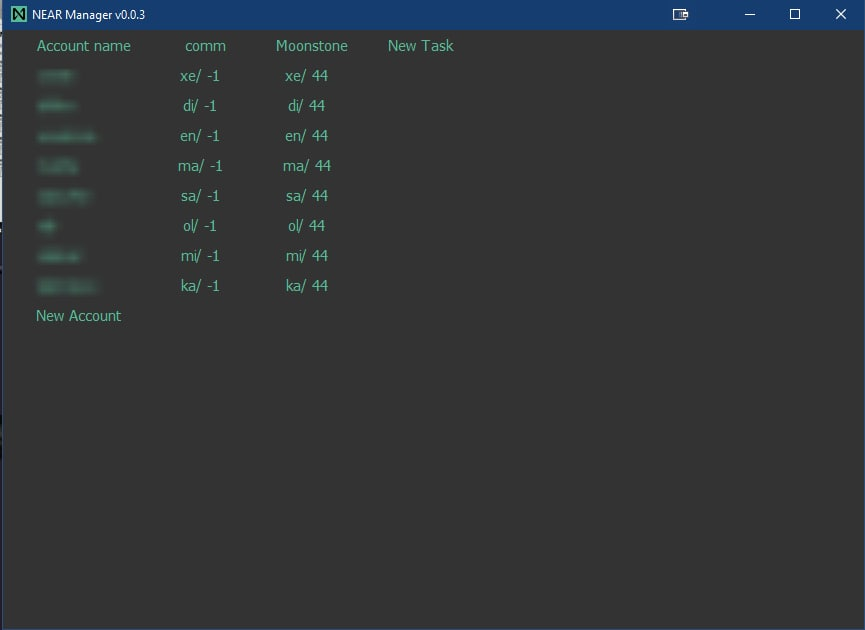

# nearcrowd
Делал программу для взятия ревью в проекте NEARCROWD.
Сам скрипт, который берет ревью лежит на сервере и делится данными с программой по необходиости.
Gui находится у пользователя и в удобном виде позволяет проверять работы.(запускается отдельный браузер, программно происходит переход внутри сайта к нужному разделу)

## В проекте:
### GUI

1. GUI - PYQT
2. Работа с потоками - threading
3. Работа по ssh с удаленным сервером - paramiko
4. Переменные в среде окружения - os
5. Запуск дочернего процесса - subprocess
6. Автоматизация отрытия браузера и перехода до нужного раздела - Selenium
7. Настройка конфиг файлов - ConfigParser
8. Проверка авторизации(планировалось сделать продукт платным и продавать лицензии) - PHP + MySQL

### Farm:
1. Запрос к web - requests
2. Использование классов 
3. Обработка ошибок
4. Форматирование времени - datetime
5. Работа с потоками - threading
6. Работа с аргументами запуска - sys

Остался [туториал](https://youtu.be/kI8eBtDQV1c) и внешний вид программы после косметических изменений:

